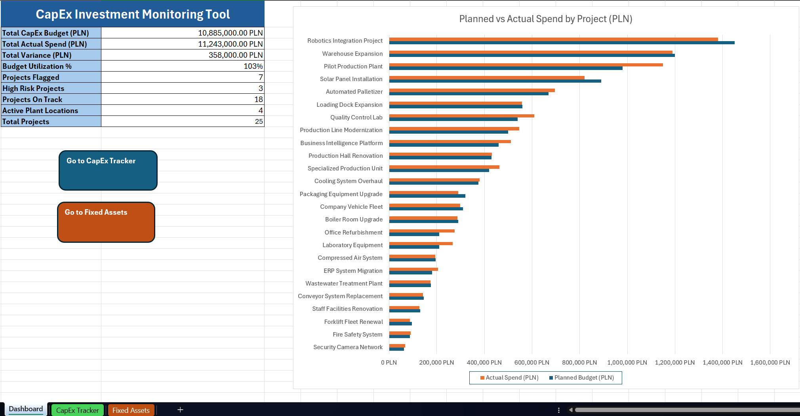
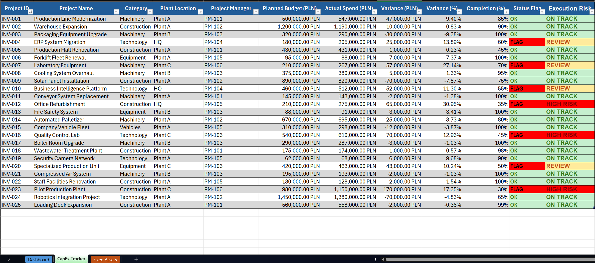
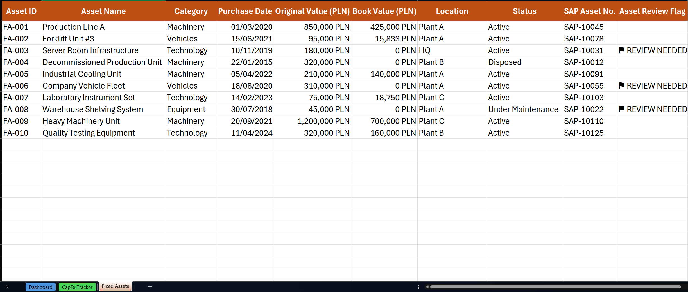

# CapEx Investment Monitoring Tool

An Excel model for tracking capital expenditure projects against their budgets — the kind of analysis a controlling (FI/CO) team runs day to day.

The workbook covers a portfolio of 25 investment projects across four sites, roughly 11 million PLN in total. It works out budget variances, flags the projects that need attention, and keeps a separate register of fixed assets with their depreciated book values. The numbers are made up, but I kept them realistic so the model behaves the way it would with actual data pulled out of an ERP system.

## What it does

The heart of it is the variance analysis on the CapEx Tracker sheet. For every project I compare the planned budget against what was actually spent — both in złoty and as a percentage — and anything more than 10% off plan gets flagged on its own, without me touching it.

The part I find more useful is the risk column sitting next to the flag. Knowing a project is over budget doesn't tell you much by itself; what matters is how far along it is. A project that's 17% over but already 90% finished is mostly a closed case. One that's 17% over at 30% completion is heading for a far bigger overrun, and that's the one a controller should be calling about. So the rating looks at both numbers together:

| Rating | When it triggers | What it means |
|--------|------------------|---------------|
| HIGH RISK | over 10% variance and under 50% complete | overspending early, likely to get worse |
| REVIEW | over 10% variance but 50%+ complete | over budget, but nearly done |
| ON TRACK | within 10% | fine |

The Dashboard sheet rolls all of this up into the summary figures a manager would actually look at: total budget and spend, utilisation rate, how many projects are flagged or high risk, how many sites are active. There's a sorted chart comparing planned against actual spend across the whole portfolio. Everything on the dashboard reads from the tracker, so changing a single number updates it all.

The Fixed Assets sheet is a register of equipment the company already owns and is depreciating. Book value is calculated automatically using straight-line depreciation, but with a different useful life per category — technology over 4 years since it dates quickly, vehicles over 6, machinery over 12, buildings over 30. There's also a small check that flags any asset already fully written down to zero but still marked active, since those are worth a second look (write off, replace, or revalue).

## How the sheets relate

Worth being clear about this: the CapEx Tracker and Fixed Assets sheets aren't linked by formulas. They're two separate registers that happen to share the same site naming (Plant A–C and HQ) so the data stays consistent across the file. The logical connection is the investment lifecycle — a finished CapEx project eventually becomes a new fixed asset — but in a real setup that hand-off would happen inside the ERP (between the project and asset accounting modules), not in a spreadsheet, so I left them independent on purpose rather than forcing a link that doesn't belong here.

## Built with

Plain Excel, nothing exotic. The work is done by `IF`, `IFS`, `AND`, `COUNTIF`, `SUMPRODUCT`, `MAX` and structured table references, with conditional formatting for the colour coding and data validation on the input columns. I set it up on the assumption that the data would normally arrive as an ERP export (SAP, most likely) refreshed through Power Query, with this workbook acting as the reporting layer on top.

## Opening it

Download the `.xlsx` and open it in Excel 2016 or newer. Use the coloured tabs at the bottom or the buttons on the Dashboard to move between sheets. The formulas are locked; the input cells (planned budget, actual spend, completion) stay editable, so you can change the figures and watch everything recalculate.

## Screenshots

